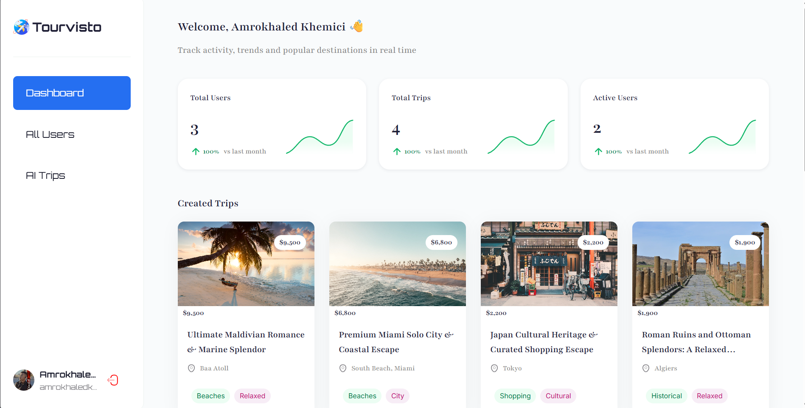

# Tourvisto 🌍
## Cover Page


## Dashboard



## Home page
[Screenshot 2](./public/assets/images/Screenshot2.png)

- **AI-Powered Itineraries:** Generate comprehensive, multi-day travel plans customized by budget, interests, and group type using Google's Gemini AI.
- **Beautiful UI/UX:** Built with a modern, responsive design and premium Syncfusion UI components.
- **Admin Dashboard:** A robust dashboard for administrators to track user growth, monitor generated trips, and analyze travel trends (with interactive charts and data grids).
- **Secure Authentication:** User management and authentication powered by Appwrite.
- **Monetization Ready:** Seamless integration with Stripe for premium trip generation or payment links.
- **Error Tracking:** Fully integrated with Sentry for real-time error monitoring and performance profiling.

##  Tech Stack

- **Framework:** [React 19](https://react.dev/) & [React Router v8](https://reactrouter.com/) (powered by Vite)
- **Styling:** [Tailwind CSS v4](https://tailwindcss.com/)
- **UI Components:** [Syncfusion EJ2 React Components](https://www.syncfusion.com/react-components)
- **Backend & Auth:** [Appwrite](https://appwrite.io/) (Node & Web SDKs)
- **AI Integration:** [Google Generative AI (Gemini Flash)](https://ai.google.dev/)
- **Payments:** [Stripe](https://stripe.com/)
- **Monitoring:** [Sentry](https://sentry.io/)

##  Getting Started

### Prerequisites

- Node.js (v18+)
- Appwrite Project
- Google Gemini API Key
- Stripe Account
- Sentry Account (Optional)

### Installation

1. Clone the repository and install dependencies:
```bash
npm install
```

2. Configure environment variables in `.env.local`:
```env
VITE_APPWRITE_ENDPOINT="your_appwrite_endpoint"
VITE_APPWRITE_PROJECT_ID="your_project_id"
VITE_APPWRITE_DATABASE_KEY="your_database_id"
VITE_APPWRITE_USERS_COLLECTION="your_users_collection_id"
VITE_APPWRITE_TRIP_COLLECTION="your_trip_collection_id"
VITE_APPWRITE_API_KEY="your_appwrite_api_key"

GEMINI_API_KEY="your_gemini_api_key"
UNSPLASH_ACCESS_KEY="your_unsplash_access_key"

STRIPE_SECRET_KEY="your_stripe_secret_key"
```

3. Run the development server:
```bash
npm run dev
```


